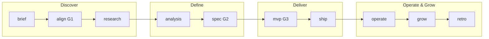

# ttmens-skills

> 一个人用 AI，从想法到上线。带门禁脚本、产物路径、可执行验收报告。

phuryn 教你**怎么做 PM 决策**；superpowers / addy 教你**怎么写可靠代码**；**ttmens-skills 教你一个人把想法做到上线**——带 `gates.json`、C4、`openspec/`、UI rubric 脚本与 GitHub Pages 阶段报告。

<!-- AUTO:COUNTS -->
- Core: **17** native + **23** borrowed = **40** skills
<!-- /AUTO:COUNTS -->

**Platforms:** Cursor | Hermes | OpenCode

---

## 60 秒开始

```bash
git clone https://github.com/ttmens/ttmens-skills.git
cd ttmens-skills
git submodule update --init --recursive
./install.sh --core --all          # Windows: .\install.ps1 -Target All
```

在你的项目根目录放 `AGENTS.md`（可复制本仓库模板），然后对 Agent 说：

> **从想法做到上线**

Agent 会加载 **`pm-idea-to-mvp`** v5.1，按阶段产出 `CONTEXT.md` → `03-prd.md` → `04-mvp/` → `RUNBOOK.md`。

---

## 说这句话，就会发生什么

| 你想… | 说… | 流水线阶段 |
|-------|-----|------------|
| 验证想法 | 帮我对齐这个想法 | align (**G1**) |
| 做竞品调研 | 进入 research 阶段 | research |
| 写 PRD + 原型 | 进入 spec 阶段 | spec (**G2**) |
| 按规格实现 MVP | 进入 mvp 阶段 | mvp (**G3**) |
| 上线前检查 | ship-check | ship |
| 继续已有项目 | 继续 pm-{slug} | 读 `docs/workflow_state.yaml` |

更多跨平台 prompt 链：[command-recipes.md](pipelines/pm-idea-to-mvp/references/command-recipes.md)

---

## 一条流水线，四个阶段

10 个 stage 折叠为读者视角的 4 phase：



| Phase | Stages | 关键产出 | 门禁 |
|-------|--------|----------|------|
| **Discover** | brief, align, research | `CONTEXT.md`, `01-research.md` | **G1** align |
| **Define** | analysis, spec | `02-analysis.md`, `03-prd.md`, `02b-prototype/` | **G2** spec |
| **Deliver** | mvp, ship | `04-mvp/`, `RUNBOOK.md`, `ui-acceptance-report` | **G3** mvp |
| **Operate** | operate, grow, retro | `06-growth.md`, `05-retro.md`, Pages 报告 | — |

入口技能：[pipelines/pm-idea-to-mvp/SKILL.md](pipelines/pm-idea-to-mvp/SKILL.md) · Agent 规则：[AGENTS.md](AGENTS.md)

---

## 核心技能 17 个

| 技能 | 做什么 | 何时用 |
|------|--------|--------|
| **pm-idea-to-mvp** | 唯一主流水线，G1/G2/G3 | 从想法做到上线 |
| **grill-me** | 逐问对齐想法 | 新想法、无 CONTEXT.md |
| **grill-with-docs** | 基于文档对齐 + 术语漂移 | 已有 CONTEXT.md |
| **docs-hygiene** | SSOT 文档漂移检测 | 阶段边界、棕地项目 |
| **c4-architecture** | C4 架构图与 ADR | analysis 阶段 |
| **openspec** | proposal / design / tasks 规格 | 分析后写实现规格 |
| **user-journey** | 旅程驱动页面与 IA | 写 `03b-user-journey.md` |
| **open-design** | 可点击静态原型（含可选变体） | PRD 前需要原型 |
| **ui-ux-pro-max** | 从 PRD 生成 DESIGN tokens | MVP 实现前 |
| **design-system-md** | 维护 `docs/DESIGN.md` | 项目级设计 SSOT |
| **ui-acceptance-review** | journey / quick / full / polish 四模式 | MVP 与 ship、**G3** |
| **writing-plans** | 拆 bite-sized 任务 | openspec tasks 落地前 |
| **subagent-driven-development** | 子代理逐 Task 实现 | MVP 编码主循环 |
| **test-driven-development** | RED-GREEN-REFACTOR | 实现业务逻辑 |
| **requesting-code-review** | 提交前质量门 | commit 前 |
| **dogfood** | 探索式 Web QA | MVP 走查 |
| **pm-git-publish** | GitHub Pages 阶段报告 | retro / 每阶段结束 |

---

## 借用的 PM / 工程技能 23 个

安装时从 `vendor/` 复制，归因见 [borrowed/ATTRIBUTION.md](borrowed/ATTRIBUTION.md)。

| 来源 | 代表技能 | 流水线阶段 |
|------|----------|------------|
| [phuryn/pm-skills](https://github.com/phuryn/pm-skills) | `pm-create-prd`, `pm-competitor-analysis`, `pm-retro` | align → retro |
| [knowledge-work-plugins](https://github.com/anthropics/knowledge-work-plugins) | `kw-system-design`, `kw-code-review`, `kw-deploy-checklist` | analysis → operate |

完整路径与 stage 索引：[docs/SKILLS_CATALOG.md](docs/SKILLS_CATALOG.md)

---

## 可选扩展包

```bash
./install.sh --profile obsidian --all       # Obsidian 笔记三件套
./install.sh --profile deep-research --all  # industry-benchmark 深研
./install.sh --profile hermes --all         # plan + opencode（Hermes 编排）
```

| Profile | 技能 | 场景 |
|---------|------|------|
| **obsidian** | todo-manager, deepen-review, note-summarizer | 笔记驱动调研与任务 |
| **deep-research** | industry-benchmark | 行业对标深研 |
| **hermes** | plan, opencode | Kanban 分派 + `opencode run` |

---

## 和其他仓库怎么搭配

| 仓库 | 角色 | 建议 |
|------|------|------|
| [phuryn/pm-skills](https://github.com/phuryn/pm-skills) | PM 方法论 | 本库已借核心 16 项；无需重复安装 |
| [obra/superpowers](https://github.com/obra/superpowers) | TDD / 子代理 / 计划 | 可叠加；本库 `writing-plans` 等已含 slim 版 |
| [addyosmani/agent-skills](https://github.com/addyosmani/agent-skills) | 工程生命周期 | 互补；本库侧重**产物路径 + 脚本门禁** |

差异化：**可执行流水线** + **`ui_acceptance.py` / `check_docs_ssot.py`** + **pm-{slug} 目录契约** + **三平台安装**。

---

## 安装

| 场景 | 命令 |
|------|------|
| 默认（推荐） | `./install.sh --core --all` |
| 仅 native | `./install.sh --core --cursor` |
| 仅 borrowed | `./install.sh --borrowed-only --all` |
| 项目级安装 | `./install.sh --core --all --project /path/to/app` |

| Platform | 全局路径 | 项目路径 | 文档 |
|----------|----------|----------|------|
| Cursor | `~/.cursor/skills/` | `.cursor/skills/` | [cursor.md](docs/platforms/cursor.md) |
| Hermes | `~/.hermes/skills/` | — | [hermes.md](docs/platforms/hermes.md) |
| OpenCode | `~/.config/opencode/skills/` | `.opencode/skills/` | [opencode.md](docs/platforms/opencode.md) |

Windows: `.\install.ps1 -Target All`（默认 `--core`）

---

## 门禁与脚本

| Gate | 产出 |
|------|------|
| G1 | align：`CONTEXT.md` |
| G2 | spec：`03-prd.md` + 原型 |
| G3 | mvp：`docs/ui-acceptance-report.md` |

```bash
python scripts/check_docs_ssot.py --project-root .
python scripts/ui_acceptance.py --project-root . --mode quick
python validate_skills.py
python scripts/sync_readme.py --check
```

---

## 维护者

- 技能全量目录（路径 / stage / platform）：[docs/SKILLS_CATALOG.md](docs/SKILLS_CATALOG.md) — `python scripts/sync_readme.py --write`
- SSOT 配置：`marketplace.yaml`, `borrowed/manifest.yaml`, `platforms.yaml`
- 已删除技能归档：`deprecated/`

## License

MIT
