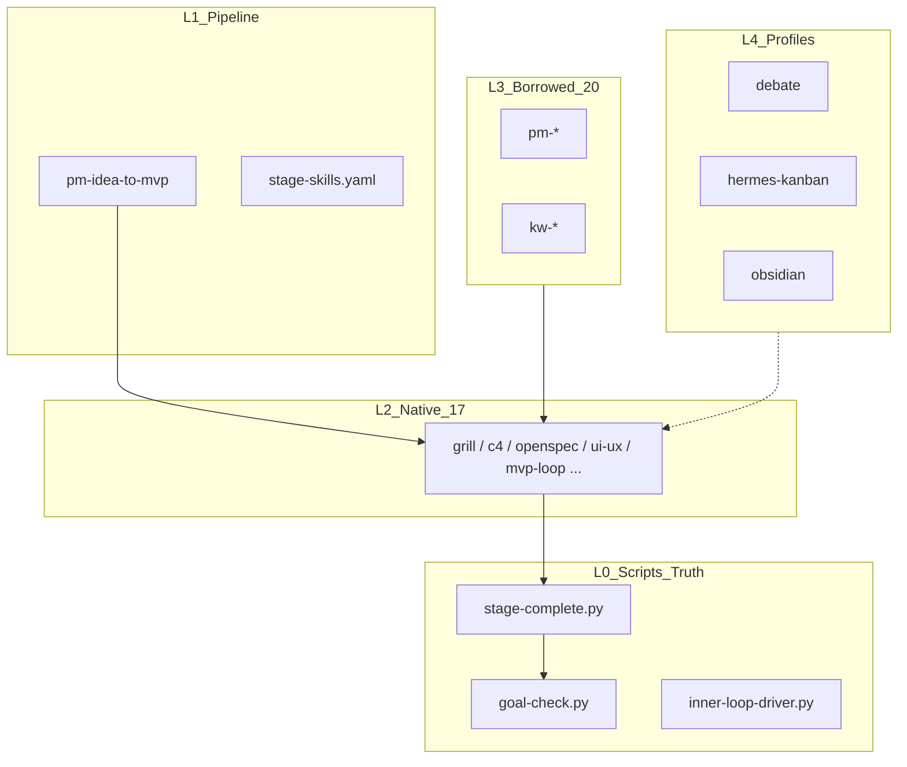
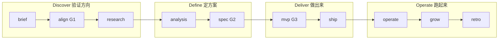

# ttmens-skills

> **一个人用 AI，从想法到上线。**  
> 不是「更多 prompt」，而是 **可验证的 Loop Engineering 流水线**——每个阶段有产物路径、门禁脚本、辩论 gate 与 GitHub Pages 报告。

phuryn 教你怎么做 PM 决策；superpowers / addy 教你怎么写可靠代码；**ttmens-skills 把两者缝成一条能跑到上线的链**——带 `gates.json`、C4、`openspec/`、`ui_acceptance.py` rubric，以及 pm-{slug} 目录契约。


- Core: **17** native + **20** borrowed = **37** skills


**Platforms:** Cursor · Hermes · OpenCode · **Pipeline:** `pm-idea-to-mvp` v7.2.0

**架构总览：** `[docs/ARCHITECTURE.md](docs/ARCHITECTURE.md)` — 本地 Hermes + OpenCode 唯一编排、双卡点、deploy 解耦

---

## 设计思想（读这一节就懂「为什么这样建」）

### 1. 产物优先，脚本为真（Artifact-first, Script as SSOT）

Agent 可以写很多 markdown，但**只有脚本能证明阶段真的完成了**。

- **L0 可执行层**（门禁、goal、内循环）是单一真相源  
- **L1 流水线文档**（`pm-idea-to-mvp/SKILL.md`）告诉 agent「当前阶段该产出什么、调什么脚本」  
- **L2 技能**是操作手册，不是替代品——阶段结束必须跑 `stage-complete.py`

> 理念：**Trust, but verify.** 人类 On-the-loop，机器 Off-the-loop 跑验证。

### 2. 双循环：Why Loop × How Loop

借鉴 Martin Fowler 的双循环框架，把「方向对不对」和「做得快不快」分开：


| 循环               | 阶段                                  | 回答的问题            |
| ---------------- | ----------------------------------- | ---------------- |
| **Why Loop**（战略） | align → research → analysis → retro | 这个想法值得做吗？假设还成立吗？ |
| **How Loop**（执行） | spec → mvp（内循环）→ ship → operate     | 怎么最小成本验证？怎么稳定交付？ |


两环通过 `feedback.jsonl`、`evolution-notes.md`、`harness-improvements.md` 闭合——retro 的教训会回流到 harness 与下一 sprint。

### 3. On-the-loop 双卡点（align + ship）

v7.2 仅 **align**（方向）与 **ship**（上线）阻塞等人；中间 research→spec→mvp **全自动**。

- **G1/G2 辩论**（align/spec）→ 由 `goal-check.py` + grill/红队脚本验证，**不占用人工 unblock**
- **High risk**（部署、迁移）→ ship checkpoint + `deploy.yaml` per slug
- 飞书解卡：`确认 t_xxx` 或 `hermes kanban unblock t_xxx`（见 `[docs/ARCHITECTURE.md](docs/ARCHITECTURE.md)`）

### 4. 少而精的技能层

37 个 core skill 是有意裁剪的结果（v3.1 从 44 瘦身）：

- 重叠能力**合并进父技能**（G1 辩论 → `grill-me`；架构 PK → `c4-architecture`；DESIGN 维护 → `ui-ux-pro-max`）  
- /vendor 深度**按需 profile 安装**（G2 红队 → `--profile debate`）  
- **Hermes Kanban profile** 是调度壳，不计入 skill 数量

### 5. 一个想法 = 一个仓库

每个 pm-{slug} 是独立 GitHub 仓库 + Pages 报告。流水线不是「聊天话题」，是**可续跑、可审计、可展示**的项目实例。

### 6. 单编排大脑 + 部署解耦（v7.2）

- **编排 SSOT**：本地 `HERMES_HOME` Gateway + Kanban + OpenCode；远端 VPS 仅 SSH runtime
- **deploy**：`deploy.yaml` per 项目 + `config/deploy-servers.yaml` 注册表（模板见 `[templates/hermes/config/deploy-servers.template.yaml](templates/hermes/config/deploy-servers.template.yaml)`）
- **通知 SSOT**：`pipeline_notify.py` → Pages 深链 + manifest 产物清单

### 7. Agent 行为准则与实战强化（v7.0 / v7.1 / v7.2）

融合 [addyosmani/agent-skills](https://github.com/addyosmani/agent-skills) 与 pm-knowledge-platform E2E 复盘：

- **6 条不可协商准则**：假设前置、管理困惑、反谄媚、强制简洁、范围纪律、验证而非假设
- **每阶段反合理化表格**：常见借口 → 反驳（防止 agent 合理化跳过关键步骤）
- **5 轴 Code Review**：正确性 / 可读性 / 架构 / 安全 / 性能 + 严重性标签
- **v7.1 实战强化**：Ship 阶段强制浏览器 E2E、回退决策树、棕地强制审计、Inner Loop 入口检查

详见 `[agent-behavior-code.md](pipelines/pm-idea-to-mvp/references/agent-behavior-code.md)`、`[rollback-decision-tree.md](pipelines/pm-idea-to-mvp/references/rollback-decision-tree.md)`、`[brownfield-audit.md](pipelines/pm-idea-to-mvp/references/brownfield-audit.md)`

---

## 60 秒开始（给人）

```bash
git clone https://github.com/ttmens/ttmens-skills.git
cd ttmens-skills
git submodule update --init --recursive
./install.sh --core --profile debate --all   # Windows: .\install.ps1 -Target All
python scripts/detect_agent_env.py --json    # 检测平台与 SKILLS_ROOT
python scripts/validate_skills.py            # 安装后自检
```

项目根目录放 `AGENTS.md`（可复制 `[templates/cursor/AGENTS.md](templates/cursor/AGENTS.md)`），对 Agent 说：

> **从想法做到上线**

产出链：`00-brief.md` → `CONTEXT.md` → `03-prd.md` → `04-mvp/` → `RUNBOOK.md` → Pages 报告。

---

## Agent 入口（给 Agent 读）


| 键                    | 值                                                                                           |
| -------------------- | ------------------------------------------------------------------------------------------- |
| **默认技能**             | `pm-idea-to-mvp` v7.2.0                                                                     |
| **Live 入口**          | `pipelines/pm-idea-to-mvp/`（勿用 `v6.1.0/` 快照）                                                |
| **SSOT 流水线**         | `[pipelines/pm-idea-to-mvp/SKILL.md](pipelines/pm-idea-to-mvp/SKILL.md)`                    |
| **Stage → Skill 映射** | `[pipelines/pm-idea-to-mvp/stage-skills.yaml](pipelines/pm-idea-to-mvp/stage-skills.yaml)`  |
| **技能清单**             | `[marketplace.yaml](marketplace.yaml)` + `[borrowed/manifest.yaml](borrowed/manifest.yaml)` |
| **环境变量**             | `{PROJECT_ROOT}` = pm-{slug} 根；`{SKILLS_ROOT}` = 技能库根（解析见 onboarding）                       |
| **安装与自检**            | `[docs/AGENT_ONBOARDING.md](docs/AGENT_ONBOARDING.md)`                                      |
| **环境检测**             | `python {SKILLS_ROOT}/scripts/detect_agent_env.py --json`                                   |


### Agent 启动顺序

1. `detect_agent_env.py --json` → 若 `install_needed` 则执行推荐 install 命令
2. `validate_skills.py`
3. 读 `pipelines/pm-idea-to-mvp/SKILL.md` + 当前 stage 的 `stage-skills.yaml` 条目

### 触发语


| 意图      | 用户可能说            | 动作                                                         |
| ------- | ---------------- | ---------------------------------------------------------- |
| 新想法 0→1 | 从想法做到上线、帮我做 MVP  | 从 `brief` 或 `align` 开始，加载 `pm-idea-to-mvp`                 |
| 续跑      | 继续 pm-{slug}     | 读 `{PROJECT_ROOT}/docs/workflow_state.yaml` 或 `gates.json` |
| 棕地      | 优化现有产品           | `--scenario brownfield`；读 `brownfield-bootstrap`           |
| 单阶段     | 进入 spec / mvp 阶段 | 只加载该 stage 技能（见 stage-skills.yaml）                         |


### 阶段边界（强制）

每个 stage 结束前**必须**：

```bash
python {SKILLS_ROOT}/pipelines/pm-idea-to-mvp/scripts/stage-complete.py \
  --project-root {PROJECT_ROOT} --stage <stage> --verify-goals
```

非零 exit → 阶段未完成，不得进入下一阶段。

MVP 内循环使用：

```bash
python {SKILLS_ROOT}/pipelines/pm-idea-to-mvp/scripts/inner-loop-driver.py \
  --project-root {PROJECT_ROOT}
```

### 三道质量门


| Gate   | Stage    | 脚本验证                                                             | 人文含义        |
| ------ | -------- | ---------------------------------------------------------------- | ----------- |
| **G1** | align    | `goal-check.py --stage align`（含 `debate_resolved`）               | 假设被挑战过，不是自嗨 |
| **G2** | spec     | `goal-check.py --stage spec`（含 PRD 辩论）                           | PRD 经红队审查   |
| **G3** | mvp/ship | 测试 + lint + build + `ui_acceptance.py --full` + 浏览器 E2E（ship 强制） | 能跑、能看、能部署   |


G1 辩论协议：`grill-me` / `grill-with-docs` § G1 Debate Protocol  
G2 红队面板：`prd-red-team-panel`（依赖 `--profile debate` 的 phuryn 技能）

### 语言

面向用户的产物（brief、PRD、retro、UI 文案）→ **简体中文**。代码与 YAML 键名可英文。

**首次使用 / 未安装技能**：先读 `[docs/AGENT_ONBOARDING.md](docs/AGENT_ONBOARDING.md)`（分平台安装、`{SKILLS_ROOT}` 解析、自检）。


---

## 能力全景

### 架构分层




### 10 个 Stage → 4 个 Phase（给人看的地图）




| Phase        | Stages                 | 关键产物                                                                 | 门禁     |
| ------------ | ---------------------- | -------------------------------------------------------------------- | ------ |
| **Discover** | brief, align, research | `CONTEXT.md`, `01-research.md`, `debates/align-`*                    | **G1** |
| **Define**   | analysis, spec         | `02-analysis.md`, `architecture/c4-`*, `03-prd.md`, `02b-prototype/` | **G2** |
| **Deliver**  | mvp, ship              | `04-mvp/`, `UX-REVIEW.md`, `RUNBOOK.md`, `ui-acceptance-report`      | **G3** |
| **Operate**  | operate, grow, retro   | `06-growth.md`, `05-retro.md`, Pages                                 | —      |


完整 stage 表（含 borrowed 列）：`[pipelines/pm-idea-to-mvp/SKILL.md](pipelines/pm-idea-to-mvp/SKILL.md)`

### 场景（Scenario）


| ID           | 入口       | 跳过                     | 用途                              |
| ------------ | -------- | ---------------------- | ------------------------------- |
| `greenfield` | brief    | —                      | 默认 0→1                          |
| `brownfield` | analysis | brief, align, research | 优化现有产品；见 `brownfield-bootstrap` |
| `refine`     | mvp      | 至 spec                 | 深化循环 + `deep-research` profile  |
| `optimize`   | analysis | brief, align, research | 轻量棕地                            |


配置：`[scenarios.yaml](scenarios.yaml)`

---

## 技能能力矩阵

### Native 17（ttmens 差异化）


| 技能                              | Stage             | 能力                                     |
| ------------------------------- | ----------------- | -------------------------------------- |
| **pm-idea-to-mvp**              | all               | 唯一主流水线；编排 G1/G2/G3                     |
| **grill-me**                    | align             | 逐问对齐 + **G1 假设辩论**（Advocate/Skeptic）   |
| **grill-with-docs**             | align             | 文档 grounded 对齐 + G1 辩论                 |
| **docs-hygiene**                | analysis,mvp,ship | SSOT 漂移检测与修复                           |
| **c4-architecture**             | analysis          | C4 L1–L3 + **架构 PK 辩论**                |
| **openspec**                    | analysis,spec     | proposal / design / tasks 规格驱动         |
| **user-journey**                | spec              | 旅程 → 页面 IA                             |
| **open-design**                 | spec              | 可点击静态原型                                |
| **ui-ux-pro-max**               | spec,mvp          | DESIGN.md tokens + **漂移维护**            |
| **prd-red-team-panel**          | spec              | **G2 红队面板**（需 debate profile）          |
| **writing-plans**               | mvp               | bite-sized 实现任务                        |
| **subagent-driven-development** | mvp               | 逐 Task 子代理实现                           |
| **test-driven-development**     | mvp               | RED-GREEN-REFACTOR                     |
| **requesting-code-review**      | mvp,ship          | 提交前质量门                                 |
| **dogfood**                     | mvp,ship          | 探索式 Web QA                             |
| **ui-acceptance-review**        | mvp,ship          | journey / quick / full / polish；**G3** |
| **pm-git-publish**              | retro             | GitHub Pages 阶段报告                      |


### Borrowed 20（vendor 深度）

安装时从 `vendor/` 复制。完整列表：[docs/SKILLS_CATALOG.md](docs/SKILLS_CATALOG.md)


| Stage    | 技能                                                                                                       |
| -------- | -------------------------------------------------------------------------------------------------------- |
| align    | `pm-identify-assumptions-new`                                                                            |
| research | `pm-opportunity-solution-tree`, `pm-competitor-analysis`, `pm-market-sizing`                             |
| analysis | `pm-product-strategy`, `kw-system-design`                                                                |
| spec     | `pm-create-prd`, `pm-user-stories`                                                                       |
| mvp      | `kw-testing-strategy`                                                                                    |
| ship     | `pm-shipping-artifacts`, `pm-intended-vs-implemented`, `kw-deploy-checklist`, `pm-security-audit-static` |
| operate  | `kw-incident-response`, `kw-runbook`, `pm-sql-queries`                                                   |
| grow     | `pm-north-star-metric`, `pm-gtm-strategy`                                                                |
| retro    | `pm-retro`, `pm-release-notes`                                                                           |


归因：[borrowed/ATTRIBUTION.md](borrowed/ATTRIBUTION.md)

### Optional Profiles（不计入 37 core）


| Profile             | 内容                                      | 何时装                           |
| ------------------- | --------------------------------------- | ----------------------------- |
| **debate**          | `pm-strategy-red-team`, `pm-pre-mortem` | spec 红队面板、brownfield          |
| **hermes-kanban**   | pm-aligner … pm-growth（8 个）             | Hermes Kanban 分阶段 dispatch    |
| **hermes**          | plan, opencode                          | Hermes 计划模式 / OpenCode worker |
| **obsidian**        | 笔记三件套                                   | 调研与任务管理                       |
| **deep-research**   | industry-benchmark                      | refine 场景                     |
| **ui-pro-max-full** | nextlevelbuilder CSV 设计 intelligence    | spec/mvp 需行业配色或多 stack 推理     |
| **playwright-e2e**  | Playwright 自动化 + `e2e/` 模板              | ship 前回归测试                    |
| **ux-principles**   | uxui-evaluator + interface-auditor      | journey/full 前置 UX 原则审计       |


---

## 可执行能力（脚本与连接器）

### 流水线脚本（L0）


| 脚本                                       | 作用                                         |
| ---------------------------------------- | ------------------------------------------ |
| `decompose-pm-pipeline.py`               | 确定性拆任务 + 生成 `goals/*.yaml`                 |
| `stage-complete.py`                      | 阶段完成编排（gates + eval + goal + 推送）           |
| `goal-check.py`                          | 目标原语：文件、内容、命令、**debate_resolved**          |
| `validate-gates.py`                      | artifact + runtime 双层门禁                    |
| `eval-stage.py`                          | 阶段 rubric 评分（含中文锚点）                        |
| `inner-loop-driver.py`                   | MVP Plan→Code→Test→Observe 内循环             |
| `harness-runner.py`                      | 风险分级自动化 + apply-safe 进化                    |
| `progress-tracker.py`                    | `PROGRESS.md` 任务级追踪                        |
| `kanban-sync.py`                         | Hermes Kanban 状态同步                         |
| `phase-transition.py`                    | 设计缺陷 detected → 阶段回流                       |
| `refine-decompose.py`                    | Refine 场景专用拆任务                             |
| `init-project.py`                        | 初始化治理产物（goals/, debates/, feedback.jsonl）  |
| `consume-feedback.py`                    | retro 消费 feedback.jsonl 闭环                 |
| `feishu-grill-preflight.py`              | Feishu grill 预检（Hermes）                    |
| `kanban-status-report.py`                | Kanban 状态报告（`--feishu-notify`）             |
| `pipeline_notify.py`                     | Feishu/Kanban 通知 SSOT（manifest + Pages 深链） |
| `deploy_servers.py` / `ssh_preflight.py` | deploy 注册表解析 + SSH 预检                      |
| `pm-e2e-smoke.py`                        | 流水线 E2E 自检                                 |
| `pipeline_observability.py`              | 可观测性 + skills sync fallback                |
| `batch-init-projects.py`                 | 批量 init pm-* 项目                            |
| `bootstrap_github_repo.py`               | GitHub 仓库 bootstrap（`--dir --slug`）        |
| `merge_retro_sections.py`                | 结构化 retro 知识合并到 pipeline-knowledge         |


路径：`pipelines/pm-idea-to-mvp/scripts/`

### 项目级脚本


| 脚本                                 | 作用                                                         |
| ---------------------------------- | ---------------------------------------------------------- |
| `scripts/ui_acceptance.py`         | UI rubric（quick/full，G3；`--profile generic|stock-copilot`） |
| `scripts/lighthouse_check.py`      | Lighthouse Performance gate（ship 推荐，无 Node 时 warning）      |
| `scripts/check_docs_ssot.py`       | DESIGN / 文档 SSOT                                           |
| `scripts/publish_repo.py`          | GitHub Pages 阶段报告（`--project-root`）                        |
| `scripts/detect_agent_env.py`      | 平台 / SKILLS_ROOT / 安装状态检测                                  |
| `scripts/feishu_notify.py`         | 阶段完成通知（Open API + `pipeline_notify`）                       |
| `scripts/deploy-verify.py`         | 部署就绪检查                                                     |
| `scripts/merge-retro-knowledge.py` | retro bullet 合并（`--project-root`）                          |
| `scripts/self_check.py`            | MVP 子代理自检                                                  |


### 连接器

- **GitHub Pages** — 每阶段 HTML 报告（`pm-git-publish`）  
- **Feishu** — `stage-complete` 推送摘要  
- **Hermes Kanban** — profile 分派 + `kanban-sync`

---

## 说这句话，会发生什么（给人）


| 你想…        | 说…             | 阶段               |
| ---------- | -------------- | ---------------- |
| 验证想法       | 帮我对齐这个想法       | align (**G1**)   |
| 做竞品调研      | 进入 research 阶段 | research         |
| 写 PRD + 原型 | 进入 spec 阶段     | spec (**G2**)    |
| 按规格实现 MVP  | 进入 mvp 阶段      | mvp (**G3**)     |
| 上线前检查      | ship-check     | ship             |
| 继续已有项目     | 继续 pm-{slug}   | 读 workflow_state |


跨平台 prompt 替代 slash command：[command-recipes.md](pipelines/pm-idea-to-mvp/references/command-recipes.md)

---

## 安装


| 场景              | 命令                                                                                                     |
| --------------- | ------------------------------------------------------------------------------------------------------ |
| **推荐（含 G2 依赖）** | `./install.sh --core --profile debate --all`                                                           |
| Cursor + hooks  | `./install.sh --core --platform cursor --project /path/to/app`                                         |
| Hermes Kanban   | `./install.sh --core --platform hermes --profile hermes-kanban`                                        |
| OpenCode        | `./install.sh --core --platform opencode --project /path/to/app`                                       |
| 单阶段轻量           | `./install.sh --lite --stage mvp --all`                                                                |
| 棕地              | `./install.sh --core --profile debate --scenario brownfield`                                           |
| 强 UI 设计         | `./install.sh --core --profile ui-pro-max-full --all`                                                  |
| E2E 自动化         | `./install.sh --core --profile playwright-e2e --all`                                                   |
| UX 原则审计         | `./install.sh --core --profile ux-principles --all`                                                    |
| Ship 前组合（推荐）    | `./install.sh --core --profile ui-pro-max-full --profile ux-principles --profile playwright-e2e --all` |


| Platform | 全局                           | 项目内                 |
| -------- | ---------------------------- | ------------------- |
| Cursor   | `~/.cursor/skills/`          | `.cursor/skills/`   |
| Hermes   | `~/.hermes/skills/`          | —                   |
| OpenCode | `~/.config/opencode/skills/` | `.opencode/skills/` |


平台细节：[docs/platforms/cursor.md](docs/platforms/cursor.md) · [hermes.md](docs/platforms/hermes.md) · [opencode.md](docs/platforms/opencode.md)

Windows: `.\install.ps1 -Target All`（默认含 `--profile debate`）

源码模式：在 ttmens-skills 克隆根对话时，cwd 即 `{SKILLS_ROOT}`，无需 copy install。

---

## 和其他生态的关系


| 仓库                                                                                        | 教什么            | ttmens-skills 怎么用            |
| ----------------------------------------------------------------------------------------- | -------------- | ---------------------------- |
| [phuryn/pm-skills](https://github.com/phuryn/pm-skills)                                   | PM 决策框架        | core 借 14 + debate profile 2 |
| [obra/superpowers](https://github.com/obra/superpowers)                                   | TDD / 子代理 / 计划 | 本库含 slim 版 native 技能         |
| [anthropics/knowledge-work-plugins](https://github.com/anthropics/knowledge-work-plugins) | 工程 / 运维        | kw-* 覆盖 analysis→operate     |


**差异化**：不是又一个 skill 合集，而是 **stage → artifact → skill → gate → script** 单向 SSOT 的 Loop Engineering 平台。

---

## 仓库布局

目录职责与「新文件放哪里」决策树：[docs/REPO_LAYOUT.md](docs/REPO_LAYOUT.md)

---

## 维护与验证

```bash
python scripts/detect_agent_env.py --json  # 环境检测
python scripts/validate_skills.py       # marketplace + stage-skills + layout + 脚本 SSOT
python tests/test_pipeline_scripts.py  # 流水线脚本冒烟
python scripts/sync_readme.py --check  # SKILLS_CATALOG 同步
```


| 文件                                                               | 角色                                |
| ---------------------------------------------------------------- | --------------------------------- |
| `[marketplace.yaml](marketplace.yaml)`                           | 技能注册表 v3.1                        |
| `[borrowed/manifest.yaml](borrowed/manifest.yaml)`               | core borrowed 20                  |
| `[borrowed/manifest-debate.yaml](borrowed/manifest-debate.yaml)` | G2 panel 依赖                       |
| `[docs/AGENT_ONBOARDING.md](docs/AGENT_ONBOARDING.md)`           | Agent 分平台安装与自检                    |
| `[docs/REPO_LAYOUT.md](docs/REPO_LAYOUT.md)`                     | 目录职责与脚本 SSOT 规则                   |
| `[docs/SKILLS_CATALOG.md](docs/SKILLS_CATALOG.md)`               | 全量索引（`sync_readme.py --write` 生成） |
| `[deprecated/](deprecated/)`                                     | 已合并/归档技能（勿安装）                     |


Agent 规则摘要：[AGENTS.md](AGENTS.md) · Agent 安装指南：[docs/AGENT_ONBOARDING.md](docs/AGENT_ONBOARDING.md)

## License

MIT