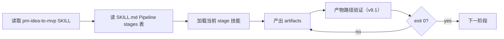

# Agent 自助：安装与使用

> **运行时规则**（阶段边界、G1/G2/G3）：[AGENTS.md](../AGENTS.md)  
> **能力全景与设计思想**：[README.md](../README.md)

本文档面向 **Cursor / Hermes / OpenCode** 上的 Agent：如何解析路径、安装技能、自检、跑流水线。

---

## 1. 判断当前平台

**首选（自动化）：**

```bash
python scripts/detect_agent_env.py --json
```

返回 `platform`、`skills_root`、`project_root`、`source_mode`、`install_needed`、`recommended_install_cmd`。

**Fallback 启发式**（命中即停）：

| 信号 | 平台 | 技能安装目录 |
|------|------|--------------|
| 项目存在 `.cursor/skills/` 或 `.cursor/hooks.json` | **Cursor（项目）** | `{PROJECT_ROOT}/.cursor/skills/` |
| 用户全局 Cursor，无项目 skills | **Cursor（全局）** | `~/.cursor/skills/` |
| 环境变量 / 上下文含 Hermes、Kanban、`pm-aligner` | **Hermes** | `~/.hermes/skills/` |
| 项目存在 `.opencode/skills/` | **OpenCode（项目）** | `{PROJECT_ROOT}/.opencode/skills/` |
| 否则 OpenCode 全局 | **OpenCode（全局）** | `~/.config/opencode/skills/` |
| 当前工作区根有 `marketplace.yaml` + `pipelines/pm-idea-to-mvp/` | **源码模式** | 工作区根 = `{SKILLS_ROOT}` |

配置 SSOT：[platforms.yaml](../platforms.yaml)

---

## 2. 解析 `{SKILLS_ROOT}`

**首选：** `detect_agent_env.py --json` 的 `skills_root` 字段。

**Fallback**（禁止硬编码 `D:\...` 或固定 clone 路径）：

```text
1. 源码模式：cwd 或上级目录含 marketplace.yaml → 该目录
2. 项目内：{PROJECT_ROOT}/.cursor/skills/ 且含 pm-idea-to-mvp/ → 该目录
3. 项目内：{PROJECT_ROOT}/.opencode/skills/ 且含 pm-idea-to-mvp/ → 该目录
4. 全局 Cursor：~/.cursor/skills/ 且含 pm-idea-to-mvp/
5. 全局 Hermes：~/.hermes/skills/ 且含 pm-idea-to-mvp/
6. 全局 OpenCode：~/.config/opencode/skills/ 且含 pm-idea-to-mvp/
```

**检测命令**：

```bash
python "{SKILLS_ROOT}/scripts/detect_agent_env.py" --json
python "{SKILLS_ROOT}/scripts/validate_skills.py"
```

或手动确认文件存在：`pipelines/pm-idea-to-mvp/SKILL.md`、`pipelines/pm-idea-to-mvp/scripts/inner-loop-driver.py`。
**`{PROJECT_ROOT}`**：当前 pm-{slug} 产品仓库根（含 `00-brief.md` 或 `gates.json` 或 `docs/workflow_state.yaml`）。  
若用户只在 ttmens-skills 仓库里对话，则 `{PROJECT_ROOT}` ≠ `{SKILLS_ROOT}`。

---

## 3. 安装（技能缺失时）

### 3.1 前置条件

在 **ttmens-skills 仓库根**执行（需用户授权 shell）：

```bash
git submodule update --init --recursive   # borrowed 技能依赖 vendor/
pip install pyyaml                        # install 脚本需要
```

### 3.2 推荐命令（完整流水线）

```bash
cd {SKILLS_ROOT}   # ttmens-skills 克隆根
./install.sh --core --profile debate --all
```

- `--core`：37 个技能（17 native + 20 borrowed）
- `--profile debate`：**G2 红队**依赖（`pm-strategy-red-team`、`pm-pre-mortem`），spec 阶段必需

Windows（默认含 `--profile debate`）：

```powershell
.\install.ps1 -Target All
# 或显式：python scripts/install_skills.py --core --profile debate --all
```

### 3.3 分平台安装

| 平台 | 命令 |
|------|------|
| **Cursor**（+ 项目 AGENTS/hooks） | `./install.sh --core --profile debate --platform cursor --project {PROJECT_ROOT}` |
| **Hermes**（+ Kanban profiles） | `./install.sh --core --profile debate --platform hermes --profile hermes-kanban` |
| **OpenCode**（+ 项目 AGENTS） | `./install.sh --core --profile debate --platform opencode --project {PROJECT_ROOT}` |

### 3.4 减载安装（单阶段）

```bash
./install.sh --lite --stage mvp --all --profile debate
```

仅安装该 stage 相关技能 + `pm-idea-to-mvp`，降低 context。

### 3.5 场景

| 场景 | 安装 |
|------|------|
| 新建 0→1 | 默认即可 |
| 优化现有产品 | 加 `--scenario brownfield`（会自动加 `debate` profile） |
| Refine 深化 | `--scenario refine`（自动加 `deep-research` profile） |
| 强 UI / E2E / UX 审计 | 见下表 Optional UI profiles |

**Optional UI / QA profiles**（可组合）：

| 场景 | 安装 |
|------|------|
| 行业配色 / CSV 设计 intelligence | `--profile ui-pro-max-full` |
| Playwright E2E | `--profile playwright-e2e` |
| UX 168 原则 + smell 审计 | `--profile ux-principles` |
| Ship 前推荐组合 | `--profile ui-pro-max-full --profile ux-principles --profile playwright-e2e` |

Agent **若无 shell 权限**：向用户说明缺少的技能 ID，并给出上表对应 `install.sh` 命令，请用户执行后再继续。

---

## 4. 自检（安装后必做）

```bash
python {SKILLS_ROOT}/scripts/detect_agent_env.py --json
python {SKILLS_ROOT}/scripts/validate_skills.py
```

通过应看到：`OK: 17 native + 20 borrowed skills; pipeline scripts present`

新项目初始化治理产物：

```bash
python {SKILLS_ROOT}/pipelines/pm-idea-to-mvp/scripts/init-project.py --project-root {PROJECT_ROOT}
```

retro 阶段消费反馈：

```bash
python {SKILLS_ROOT}/pipelines/pm-idea-to-mvp/scripts/consume-feedback.py --project-root {PROJECT_ROOT}
```
---

## 5. 加载与使用顺序



1. **始终先读** [`pipelines/pm-idea-to-mvp/SKILL.md`](../pipelines/pm-idea-to-mvp/SKILL.md)
2. **查当前 stage 技能**：[`SKILL.md stage 表`](../pipelines/pm-idea-to-mvp/SKILL.md stage 表)
3. **只写当前 stage 产物**，勿越界
4. **阶段结束**：

```bash
python {SKILLS_ROOT}/pipelines/pm-idea-to-mvp/scripts/inner-loop-driver.py \
  --project-root {PROJECT_ROOT} --stage <stage> --verify-goals
```

5. **MVP 内循环**（stage=mvp）：

```bash
python {SKILLS_ROOT}/pipelines/pm-idea-to-mvp/scripts/inner-loop-driver.py \
  --project-root {PROJECT_ROOT}
```

### 触发语

| 用户说 | 动作 |
|--------|------|
| 从想法做到上线 | greenfield，从 brief/align 开始 |
| 继续 pm-{slug} | 读 `gates.json` / `docs/workflow_state.yaml` 续跑 |
| 优化现有产品 | brownfield，`domains/product/brownfield-bootstrap` |
| 进入 spec / mvp 阶段 | 只加载该 stage 技能 |

---

## 6. 分平台要点

### Cursor

- 项目入口：复制 [`templates/cursor/AGENTS.md`](../templates/cursor/AGENTS.md) 到 `{PROJECT_ROOT}/AGENTS.md`
- `产物验证` 可写 `.cursor/stage-status.json`（若装了 hooks）
- 详见 [platforms/cursor.md](platforms/cursor.md)

### Hermes

- 新想法先 **decompose**，勿依赖 LLM 随意拆任务：

```bash
python {SKILLS_ROOT}/pipelines/pm-idea-to-mvp/scripts/# v9 removed: use init-project.py + SKILL.md stages \
  --project-root {PROJECT_ROOT} --scenario greenfield
```

- Kanban profile：`pm-aligner` … `pm-growth` 对应各 stage
- MVP 子任务：T5a Plan → T5b Inner Loop → T5c G3 Verify
- 详见 [platforms/hermes.md](platforms/hermes.md)

### OpenCode

- MVP 实现可委托：

```bash
opencode run "Implement per openspec/tasks.md and 04-mvp/DESIGN.md" --workdir {PROJECT_ROOT}/04-mvp
```

- 每个 phase 结束仍须手动/脚本跑 `产物路径验证（v9.1）`
- 可选 `--profile hermes` 安装 `opencode` skill
- 详见 [platforms/opencode.md](platforms/opencode.md)

---

## 7. 质量门速查

| Gate | Stage | 关键验证 |
|------|-------|----------|
| G1 | align | `debates/align-synthesis.md` + `goal-check --stage align` |
| G2 | spec | `prd-red-team-panel` + `debates/spec-synthesis.md`（需 debate profile） |
| G3 | mvp/ship | 测试/lint/build + `ui_acceptance.py --full` + 浏览器 E2E（ship 强制） |

---

## 8. 常见问题

| 现象 | 原因 | 处理 |
|------|------|------|
| `产物验证` 找不到脚本 | `{SKILLS_ROOT}` 错误 | 按 §2 重算；或运行 install |
| G2 `debate_resolved` 失败 | 未装 debate profile | `./install.sh --profile debate --all` |
| borrowed 技能缺失 | vendor submodule 未 init | `git submodule update --init --recursive` 后重装 |
| `validate_skills.py` 失败 | marketplace 与 SKILL.md 不一致 | 拉最新 main，勿用 `deprecated/` 下技能 |
| Agent 加载了旧路径 | 根目录 `pm-idea-to-mvp/` 或 `v6.1.0/` 快照 | 只用 live `pipelines/pm-idea-to-mvp/` |

---

## 9. 索引

| 文档 | 用途 |
|------|------|
| [AGENTS.md](../AGENTS.md) | 运行时强制协议 |
| [SKILLS_CATALOG.md](SKILLS_CATALOG.md) | 全技能表 |
| [REPO_LAYOUT.md](REPO_LAYOUT.md) | 目录与脚本 SSOT |
| [command-recipes.md](../pipelines/pm-idea-to-mvp/references/command-recipes.md) | 无 slash command 时的 prompt 链 |
| [scenarios.yaml](../scenarios.yaml) | greenfield / brownfield / refine |
