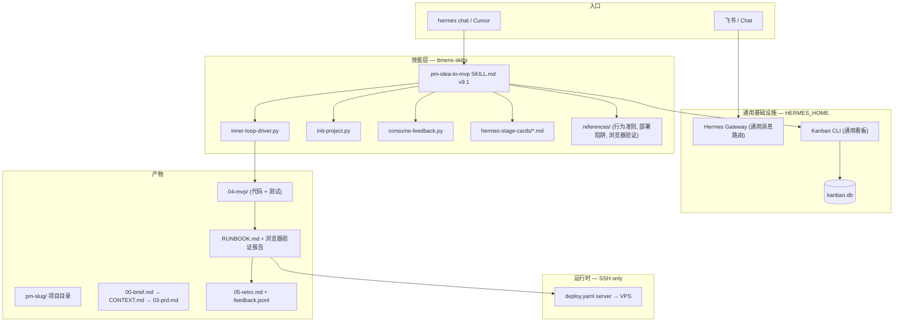

# ttmens-skills 系统架构总览（v9.1.0）

> **Git SSOT**：本仓库（`ttmens/ttmens-skills`）是技能库的唯一真相源。  
> **运行时 SSOT**：`HERMES_HOME`（如 `D:/hermes-data`）承载 Hermes Agent、通用 Kanban CLI、profiles、`.env`。  
> **Companion**：`hermes-agent` 提供 Gateway 消息路由与多平台适配，不在本 repo 内。

---

## 1. 系统定位

ttmens-skills 不是 prompt 合集，而是 **Loop Engineering 平台**：


| 层级         | 职责                                           | 位置                                        |
| ---------- | -------------------------------------------- | ----------------------------------------- |
| **L0 脚本**  | 内循环驱动、项目初始化、反馈闭环                           | `pipelines/pm-idea-to-mvp/scripts/`       |
| **L1 流水线** | 产物契约、阶段指导、参考文档                            | `pipelines/pm-idea-to-mvp/`               |
| **L2 技能**  | 19 native + 20 borrowed 操作手册           | `domains/` + `devops/` + `skills/infra-ops/` |
| **L3 编排**  | Hermes Gateway（通用消息路由）+ OpenCode        | `HERMES_HOME/` + `hermes-agent/`          |
| **L4 运行时** | SSH 部署目标（PM2/Node/Docker）                    | 远端 VPS，**无 Hermes Gateway**               |


**架构决策（v9.0）**：本地 Windows **Hermes + OpenCode** 为唯一编排大脑；远端服务器仅作 deploy/runtime。流水线由 SKILL.md 驱动，无 Kanban 编排脚本。

---

## 2. 端到端数据流



### 典型路径（Greenfield）

1. 用户描述产品想法 → Agent 加载 `pm-idea-to-mvp` SKILL.md
2. **Align**：grill-me / grill-with-docs → CONTEXT.md + decisions.md
3. **Research**：竞品调研 → 01-research.md（≥5 URLs）
4. **Analysis**：方案对比 + C4 架构 → 02-analysis.md + architecture/c4-*.md
5. **Spec**：用户旅程 + 原型 + PRD + OpenSpec → 03-prd.md + openspec/
6. **MVP**：inner-loop-driver.py 驱动 Plan→Code→Test→Observe（max 3 iter）
7. **Ship**：infra-ready gate 预检 → RUNBOOK.md + 浏览器 E2E 验证 → SSH 部署
8. **Operate**：infra-patrol 持续监控（quick 15min / full 4h）
9. **Retro**：consume-feedback.py 闭环 → feedback.jsonl + evolution-notes.md

**人工卡点**：**align + ship**（2 个）。spec 的 G2 由 `prd-red-team-panel` 技能验证，不占人工 unblock。

---

## 3. 设计理念（6 条）

### 3.1 Artifact-first, SKILL.md as SSOT

阶段完成由产物路径证明（SKILL.md 中定义的目录结构），不靠 agent 自报。  
理念：**Trust, but verify.**

### 3.2 On-the-loop 双卡点


| 卡点        | 阶段  | 人文含义        |
| --------- | --- | ----------- |
| **align** | 方向  | 假设被挑战过，值得继续 |
| **ship**  | 上线  | 部署风险需人确认    |


中间 **research → analysis → spec → mvp** 全自动。spec 的 G2 辩论由 `prd-red-team-panel` 技能验证，**不占用人工 unblock**。

### 3.3 单编排大脑

- 本地 Windows **Hermes + OpenCode** 为唯一编排大脑
- 远端 VPS **不**跑 Hermes Gateway（避免双脑、消息进错实例）
- OpenCode 与 pm-builder 同机，`04-mvp/` 为 workdir

### 3.4 流水线与部署解耦

- 每项目 `deploy.yaml`：`server: <id>` 指向 `HERMES_HOME/config/deploy-servers.yaml` 注册表
- 密码仅在 `HERMES_HOME/.env`（`SSH_PASSWORD_`*），不进 Git
- 流水线全局不绑定单一服务器；US/SG/CN 按 slug 路由

### 3.5 飞书 = 入口 + 审阅

- Grill 前置 enrich brief
- 阶段完成：`scripts/feishu_notify.py` 统一通知
- Gateway 通用消息路由，不依赖 PM pipeline 专用代码

### 3.6 Trust but verify（过程证据）

- `04-mvp/` 目录：代码 + 测试 + UX-REVIEW.md
- `feedback.jsonl`：内循环迭代记录
- `validate_skills.py`：技能库自检

### 3.7 基础设施自动化（v9.2 新增）

平台级基础设施自动化层，解决 65% agent 时间花在 SSH/部署/网络/Git 的问题：

| 组件 | 位置 | 功能 |
|------|------|------|
| `infra-ops` skill | `skills/infra-ops/SKILL.md` | 运维知识 SSOT（deploy-servers.yaml 数据流、SSH 认证、网络拓扑、Gateway 生命周期、故障排查决策树） |
| `infra` 工具集 | `hermes-agent/tools/infra_tools.py` | 7 个工具：health_check / recover / ssh_probe / ssh_config_sync / git_remote_check / gateway_status / infra_patrol |
| `infra-patrol` cron | `hermes-agent/cron/infra_patrol.py` | 自动巡检（quick 15min / full 4h），三级响应策略 |
| Gateway health hook | `hermes-agent/gateway/health_hook.py` | Feishu WS 线程活性检测 + all-platforms-down 断路器 |
| Pipeline infra-ready gate | `pipelines/pm-idea-to-mvp/assets/gates.template.json` | Ship 阶段前置基础设施预检 |

预期效果：基础设施时间占比从 65% → <10%。

---

## 4. 实现方式（三层）


| 层                  | 实现                                | 关键路径                                       |
| ------------------ | --------------------------------- | ------------------------------------------ |
| **路由/编排**          | Hermes Gateway（通用消息路由）          | `hermes-agent/hermes_cli/`（companion）      |
| **流水线 guardrails** | 3 个核心 Python 脚本                   | `pipelines/pm-idea-to-mvp/scripts/`          |
| **Agent 价值**       | pm-* profiles + skills + OpenCode | `profiles/hermes-kanban/` + `domains/`     |


---

## 5. v9.0 相对 v7.2 变更


| 变更                     | 说明                                                            |
| ---------------------- | ------------------------------------------------------------- |
| **删除 Kanban 编排**       | 移除 ~100 个编排文件（decompose、stage-complete、validate-gates 等）     |
| **SKILL.md 精简**       | 1,401 → 244 行，聚焦双循环方法论，去掉脚本命令引用                      |
| **remote-server-deployment 拆分** | 2,113 → 130 行核心 + 3 个参考文档                                  |
| **Gateway 死代码清理**     | 删除 pm_pipeline.py、feishu_pipeline_cards.py、pm_kanban_guard.py |
| **通用 Kanban 保留**       | kanban.py/kanban_db.py/kanban_decompose.py 仍可用于通用任务管理         |
| **三卡点**               | align + ship 人工确认（spec 仅 G2 技能门）                          |


---

## 6. 目录与同步

```
ttmens-skills/          ← Git SSOT（本仓库）
├── pipelines/pm-idea-to-mvp/
├── domains/            ← repo 布局
├── profiles/hermes-kanban/
├── scripts/
└── templates/hermes/   ← deploy 模板（无密钥）

HERMES_HOME/skills/     ← install 目标（如 D:/hermes-data/skills）
HERMES_HOME/profiles/   ← sync-hermes-profiles.py 生成
HERMES_HOME/config/     ← deploy-servers.yaml（本地，不进 Git）
```

**同步方向**：

1. 开发：改 ttmens-skills → commit → `ttmens-skills-sync` 或 install 到 HERMES_HOME
2. 禁止：只在 HERMES_HOME 改 skills 不回灌 repo（会再次漂移）

详见 `[domains/qa/ttmens-skills-sync/SKILL.md](../domains/qa/ttmens-skills-sync/SKILL.md)`。

---

## 7. 运维要点


| 主题            | 做法                                                              |
| ------------- | --------------------------------------------------------------- |
| **Windows**   | `terminal.backend: local`；SSH 从本机执行（见 DEPLOY_CONVENTIONS）    |
| **GitHub 网络** | `git pull` 失败时用 API zip fallback（见 ttmens-skills-sync）          |
| **远端 Hermes** | 已退役为编排层；保留 SSH + Node/PM2 作 runtime                             |
| **密钥**        | `.env` chmod/ACL；rotate 任何进入聊天记录的凭据                             |
| **验证**        | `validate_skills.py` + `verify_hermes.py`（HERMES_HOME） + `check_docs_ssot.py` |


---

## 8. 预期效果

- 飞书 `/goal` 触发 Gateway + 通用 Kanban 分发；仅 align/ship 需人工确认
- align/ship 两处 HITL 通知文案统一、可深链 Pages、可清单审阅产物
- ship 才激活 deploy；多区域 target 按项目配置
- 文档/脚本/版本一致，减少 agent 与运维判断漂移

---

## 相关文档

- [README.md](../README.md) — 设计思想与快速开始
- [CODING_CONVENTIONS.md](CODING_CONVENTIONS.md) — 编码与 Agent 行为约定
- [DEPLOY_CONVENTIONS.md](DEPLOY_CONVENTIONS.md) — 部署与 SSH 约定
- [HERMES_ARCHITECTURE.md](HERMES_ARCHITECTURE.md) — Hermes Agent 运行时（companion）
- [platforms/hermes.md](platforms/hermes.md) — Hermes 安装与配置

