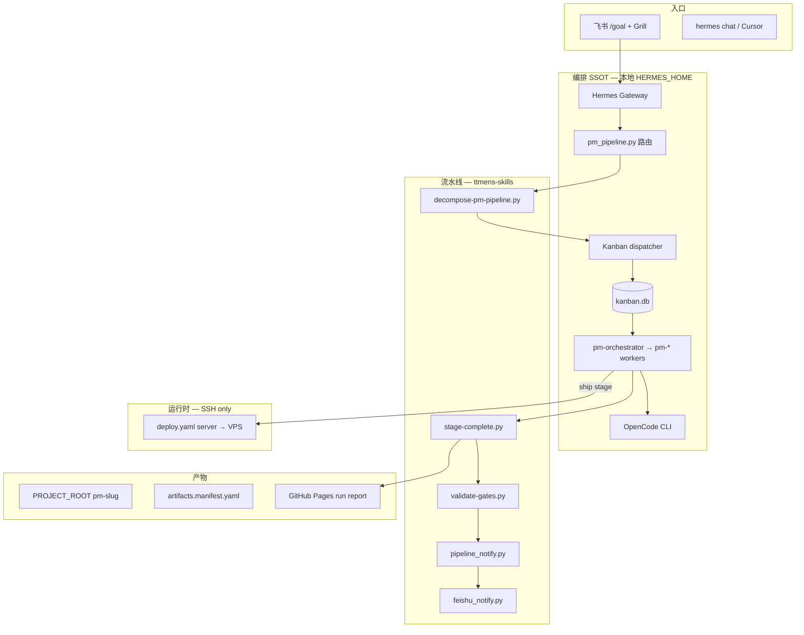

# ttmens-skills 系统架构总览（v7.2.0）

> **Git SSOT**：本仓库（`ttmens/ttmens-skills`）是技能库与流水线脚本的唯一真相源。  
> **运行时 SSOT**：`HERMES_HOME`（如 `D:/hermes-data`）承载 Gateway、Kanban、profiles、`.env`。  
> **Companion**：`hermes-agent` 提供 Gateway 路由与飞书 HITL 适配，不在本 repo 内。

---

## 1. 系统定位

ttmens-skills 不是 prompt 合集，而是 **Loop Engineering 平台**：


| 层级         | 职责                                           | 位置                                        |
| ---------- | -------------------------------------------- | ----------------------------------------- |
| **L0 脚本**  | 门禁、阶段完成、通知、部署解析                              | `pipelines/pm-idea-to-mvp/scripts/`       |
| **L1 流水线** | stage 编排、Kanban 分解、产物契约                      | `pipelines/pm-idea-to-mvp/`               |
| **L2 技能**  | 37 个 native + borrowed 操作手册                  | `domains/` → 安装到 category 目录              |
| **L3 编排**  | Hermes Gateway + 9× pm-* profiles + OpenCode | `HERMES_HOME/profiles/` + `hermes-agent/` |
| **L4 运行时** | SSH 部署目标（PM2/Node/Docker）                    | 远端 VPS，**无 Hermes Gateway**               |


**架构决策（v7.2）**：本地 Windows **Hermes + OpenCode** 为唯一编排大脑；远端服务器仅作 deploy/runtime，不跑独立 Kanban/Feishu Gateway。

---

## 2. 端到端数据流




### 典型路径（Greenfield）

1. 飞书 `/goal 产品想法：…` → `feishu-grill-preflight` 1–2 轮 → enriched `00-brief.md`
2. `decompose-pm-pipeline.py` → 12 Kanban 子任务 + `goals/*.yaml`
3. Gateway dispatcher 按 assignee spawn `pm-*` worker
4. 每 stage 结束：`stage-complete.py` → gates → git push → Feishu 通知（Pages + manifest 清单）
5. **align**、**ship** 两处人工卡点：飞书回复 `确认 t_xxx` 或 `hermes kanban unblock t_xxx`
6. ship 阶段才读取 `deploy.yaml`，经 `deploy_servers.py` + SSH 推到目标机

---

## 3. 设计理念（6 条）

### 3.1 Artifact-first, Script as SSOT

阶段完成由 `stage-complete.py` + `validate-gates.py` 证明，不靠 agent 自报。  
理念：**Trust, but verify.**

### 3.2 On-the-loop 双卡点


| 卡点        | 阶段  | 人文含义        |
| --------- | --- | ----------- |
| **align** | 方向  | 假设被挑战过，值得继续 |
| **ship**  | 上线  | 部署风险需人确认    |


中间 **research → analysis → spec → mvp** 全自动。spec 的 G2 辩论由 `goal-check.py` + `prd-red-team-panel` 脚本验证，**不占用人工 unblock**。

### 3.3 单编排大脑

- 一个 `kanban.db`、一个 Gateway dispatcher、一个 Feishu bot 入口
- 远端 VPS **不**跑 Hermes Gateway（避免双脑、消息进错实例）
- OpenCode 与 pm-builder 同机，`04-mvp/` 为 workdir

### 3.4 流水线与部署解耦

- 每项目 `deploy.yaml`：`server: <id>` 指向 `HERMES_HOME/config/deploy-servers.yaml` 注册表
- 密码仅在 `HERMES_HOME/.env`（`SSH_PASSWORD_`*），不进 Git
- 流水线全局不绑定单一服务器；US/SG/CN 按 slug 路由

### 3.5 飞书 = 入口 + 审阅

- Grill 前置 enrich brief
- 阶段完成：`pipeline_notify.py` 统一文案 → Pages 深链 + manifest 产物清单 + 解卡指令
- Gateway notifier 与 `feishu_notify.py` 共用同一 message builder

### 3.6 Trust but verify（过程证据）

- `runs/` 目录：opencode session、gate 输出
- `artifacts.manifest.yaml`：阶段产物 SSOT 模板
- `pm-e2e-smoke.py`：流水线自检

---

## 4. 实现方式（三层）


| 层                  | 实现                                | 关键路径                                       |
| ------------------ | --------------------------------- | ------------------------------------------ |
| **路由/编排**          | Hermes Gateway + `pm_pipeline.py` | `hermes-agent/hermes_cli/`（companion）      |
| **流水线 guardrails** | Python 脚本 + Kanban decompose      | `pipelines/pm-idea-to-mvp/scripts/`（35 脚本） |
| **Agent 价值**       | pm-* profiles + skills + OpenCode | `profiles/hermes-kanban/` + `domains/`     |


### Companion Gateway 依赖（非本 repo）

部署 v7.2 流水线时，本地 `hermes-agent` 需具备：


| 能力                            | 文件                                          |
| ----------------------------- | ------------------------------------------- |
| 飞书路由 / Grill / resume         | `hermes_cli/pm_pipeline.py`                 |
| 飞书 `确认 t_xxx` 解卡              | `hermes_cli/feishu_pipeline_cards.py`       |
| Kanban 通知与 pipeline_notify 对齐 | `pm_pipeline.build_kanban_notify_message()` |
| Gateway 内嵌 dispatcher         | `kanban.dispatch_in_gateway: true`          |


---

## 5. v7.2 相对 v7.1 变更


| 变更                     | 说明                                                            |
| ---------------------- | ------------------------------------------------------------- |
| **双卡点 align+ship**     | 移除 spec 人工 checkpoint；G2 仍脚本 gate                             |
| **pipeline_notify.py** | Feishu/Kanban 通知 SSOT；manifest 产物清单 + Pages tab 深链            |
| **deploy 解耦**          | `deploy_servers.py`、`ssh_preflight.py`、`deploy.template.yaml` |
| **产物 SSOT**            | `artifacts.manifest.template.yaml` + validate-gates 证据检查      |
| **E2E 自检**             | `pm-e2e-smoke.py`                                             |
| **可观测性**               | `pipeline_observability.py`                                   |
| **架构文档**               | 本文档；明确本地唯一编排                                                  |
| **stage-complete 顺序**  | build-run-report → git_push → feishu_notify                   |


---

## 6. 目录与同步

```
ttmens-skills/          ← Git SSOT（本仓库）
├── pipelines/pm-idea-to-mvp/
├── domains/            ← repo 布局
├── profiles/hermes-kanban/
├── scripts/
└── templates/hermes/   ← deploy 模板（无密钥）

HERMES_HOME/skills/     ← install 目标（如 D:/hermes-data/skills）
HERMES_HOME/profiles/   ← sync-hermes-profiles.py 生成
HERMES_HOME/config/     ← deploy-servers.yaml（本地，不进 Git）
```

**同步方向**：

1. 开发：改 ttmens-skills → commit → `ttmens-skills-sync` 或 install 到 HERMES_HOME
2. 禁止：只在 HERMES_HOME 改 skills 不回灌 repo（会再次漂移）

详见 `[domains/qa/ttmens-skills-sync/SKILL.md](../domains/qa/ttmens-skills-sync/SKILL.md)`。

---

## 7. 运维要点


| 主题            | 做法                                                              |
| ------------- | --------------------------------------------------------------- |
| **Windows**   | `terminal.backend: local`；SSH 用 paramiko（`ssh_preflight.py`）    |
| **GitHub 网络** | `git pull` 失败时用 API zip fallback（见 ttmens-skills-sync）          |
| **远端 Hermes** | 已退役为编排层；保留 SSH + Node/PM2 作 runtime                             |
| **密钥**        | `.env` chmod/ACL；rotate 任何进入聊天记录的凭据                             |
| **验证**        | `validate_skills.py` + `pm-e2e-smoke.py` + `check_docs_ssot.py` |


---

## 8. 预期效果

- 飞书一条 `/goal` 触发完整 Kanban，中间 stage 无需逐个人工确认
- align/ship 两处 HITL 通知文案统一、可深链 Pages、可清单审阅产物
- ship 才激活 deploy；多区域 target 按项目配置
- 文档/脚本/版本一致，减少 agent 与运维判断漂移

---

## 相关文档

- [README.md](../README.md) — 设计思想与快速开始
- [platforms/hermes.md](platforms/hermes.md) — Hermes 安装与 Kanban
- [pipelines/pm-idea-to-mvp/references/hermes-integration.md](../pipelines/pm-idea-to-mvp/references/hermes-integration.md) — Gateway 契约
- [pipelines/pm-idea-to-mvp/references/runtime-kanban-v7.1.md](../pipelines/pm-idea-to-mvp/references/runtime-kanban-v7.1.md) — Kanban 运行时

