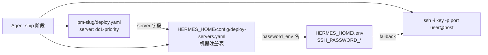

# 部署约定（Deploy Conventions）

> **SSOT**：本文 + [`templates/hermes/config/deploy-servers.template.yaml`](../templates/hermes/config/deploy-servers.template.yaml) + [`pipelines/pm-idea-to-mvp/assets/deploy.template.yaml`](../pipelines/pm-idea-to-mvp/assets/deploy.template.yaml)  
> **运行时**：`HERMES_HOME/config/deploy-servers.yaml`（本地，不进 Git）  
> **技能**：[`devops/remote-server-deployment/SKILL.md`](../devops/remote-server-deployment/SKILL.md)

---

## 1. 三层配置关系



| 层 | 文件 | 职责 |
|----|------|------|
| **注册表** | `HERMES_HOME/config/deploy-servers.yaml` | 所有 VPS 的 host/port/user/key_path/password_env |
| **项目** | `pm-{slug}/deploy.yaml` | 选择 `server:` id，可选覆盖 host/port/user |
| **密钥** | `HERMES_HOME/.env` | `SSH_PASSWORD_<SERVER_ID>` 密码 fallback |

**不存在** `deploy_servers.py` / `ssh_preflight.py` 合并器 — Agent 与技能**直接读 YAML**。

---

## 2. 字段契约

### deploy-servers.yaml（注册表）

```yaml
version: "1.0"
default_server: dc1-priority

servers:
  <server-id>:
    label: "人类可读名称"
    host: "203.0.113.10"          # 真实 IP 仅写在 HERMES_HOME 本地文件
    port: 22
    user: deploy
    key_path: "~/.ssh/id_ed25519_deploy"   # 密钥优先
    password_env: SSH_PASSWORD_<SERVER_ID> # .env 变量名
    region: cn-example
    notes: "可选备注"
```

### deploy.yaml（每项目）

```yaml
version: "1.0"
server: dc1-priority              # 指向注册表 id
host: ""                          # 空 = 用注册表
port: 22
user: ""
project_path: "~/pm-{slug}"
processes: {}
health_urls: []
secret_refs:
  ssh_key: "~/.ssh/id_ed25519_deploy"
  ssh_password: "servers/dc1-priority"   # 逻辑引用 → registry.password_env
```

### .env（仅本地）

```bash
# DEPLOY SSH (local only — see config/deploy-servers.yaml)
SSH_PASSWORD_DC1_PRIORITY=...
SSH_PASSWORD_ALIYUN_BJ=...
SSH_PASSWORD_ALIYUN_US=...
SSH_PASSWORD_TENCENT_SG=...
DEFAULT_DEPLOY_SERVER=dc1-priority
```

---

## 3. 认证优先级

1. **密钥**：`~/.ssh/id_ed25519_deploy`（统一部署密钥，配置在注册表 `key_path`）
2. **密码 fallback**：从 `password_env` 读取 `.env` 对应变量
3. **禁止**：连续 3 次以上密码 SSH（触发 fail2ban）

连接命令：

```bash
ssh -p $PORT -i ~/.ssh/id_ed25519_deploy -o ConnectTimeout=10 $USER@$HOST "echo SSH_OK"
```

---

## 4. Agent 操作流程（ship 阶段）

1. **读注册表**：`cat $HERMES_HOME/config/deploy-servers.yaml`
2. **读项目 deploy.yaml**：确认 `server:` 与 `project_path`
3. **Pre-flight**：SSH 连通、sudo 探测、pm2/node 状态（见 remote-server-deployment 技能）
4. **部署**：git pull / npm build / pm2 restart / cloudflared
5. **验证**：浏览器 E2E + health_urls（ship 门禁强制）

**默认服务器**：`dc1-priority` 承载大多数 pm-* 项目；`tencent-sg` / `aliyun-*` 用于特定服务。始终以注册表为准，**不要**从会话上下文猜服务器。

---

## 5. 服务器 ID 约定

| server id | 用途 | 备注 |
|-----------|------|------|
| `dc1-priority` | 默认 PM 项目部署 | 大多数 `deploy.yaml` 指向此 id |
| `aliyun-bj` | 阿里云北京 | 区域特定服务 |
| `aliyun-us` | 阿里云美国 | 区域特定服务 |
| `tencent-sg` | 腾讯云新加坡 | 非 PM 主路径（如 shadowsocks） |

真实 host/IP 写在 `HERMES_HOME/config/deploy-servers.yaml`，**不要**提交到 Git。

初始化模板：复制 [`templates/hermes/config/deploy-servers.template.yaml`](../templates/hermes/config/deploy-servers.template.yaml) → `HERMES_HOME/config/deploy-servers.yaml`。

---

## 6. 终端后端说明

Hermes `config.yaml` 中 `terminal.backend` 通常为 **local**（Windows 本机执行 ssh）。

- `TERMINAL_SSH_*` 环境变量存在但**默认未启用**
- 部署 SSH **不是** Hermes SSH terminal backend，而是 Agent 在本机 terminal 执行 `ssh` 命令

---

## 7. 本地运维脚本

| 脚本 | 位置 | 用途 |
|------|------|------|
| `deploy_ssh_keys.py` | `HERMES_HOME/scripts/` | 一次性/bootstrap：向注册表服务器分发公钥 |
| `verify_hermes.py` | `HERMES_HOME/scripts/` | 技能与配置健康检查 |

`deploy_ssh_keys.py` 应读取 `config/deploy-servers.yaml` + `.env`，**不应**硬编码服务器列表。

---

## 8. 相关文档

- 流水线架构：[`ARCHITECTURE.md`](ARCHITECTURE.md) §3.4
- 编码与阶段协议：[`CODING_CONVENTIONS.md`](CODING_CONVENTIONS.md)
- Hermes 运行时：[`HERMES_ARCHITECTURE.md`](HERMES_ARCHITECTURE.md)
- Git 同步方向：[`GIT_WORKFLOW.md`](GIT_WORKFLOW.md)
