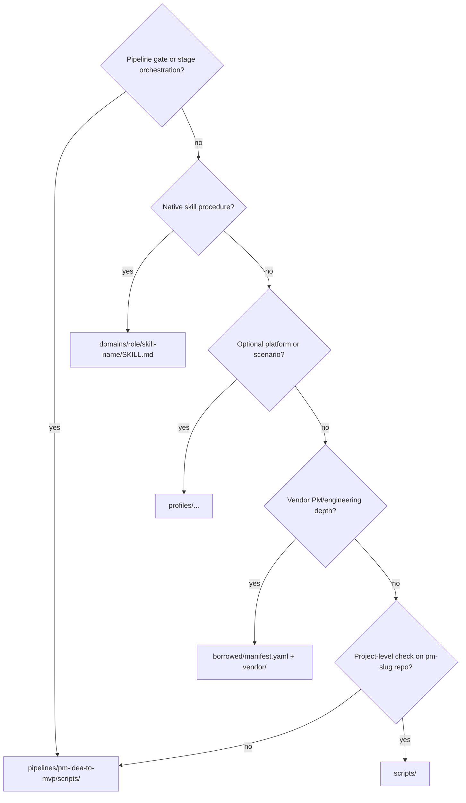

# Repository layout

> Where things live and why. SSOT for humans and agents.

## Top-level map

```
ttmens-skills/
├── README.md, AGENTS.md              # Human + agent entry
├── marketplace.yaml                  # Skill registry (native 17)
├── platforms.yaml, scenarios.yaml    # Install targets + pipeline scenarios
├── pipelines/pm-idea-to-mvp/         # Pipeline SKILL + L0 gate scripts
├── domains/                          # Core native skills (by role)
├── profiles/                         # Optional profiles (not in core 37)
├── borrowed/                         # Vendor manifests
├── scripts/                          # Repo + project tooling (SSOT)
├── templates/                        # Cursor/OpenCode project templates
├── docs/                             # Platform docs + SKILLS_CATALOG
├── tests/                            # CI smoke tests
├── vendor/                           # Git submodules (phuryn, kw)
└── deprecated/                       # Archives only — do not install
```

## Decision tree: where does new code go?



| Question | Put it in |
|----------|-----------|
| Stage gate, goal-check, inner-loop, decompose | `pipelines/pm-idea-to-mvp/scripts/` |
| Agent procedure for one capability | `domains/{product,design,engineering,agents,qa}/<skill>/SKILL.md` |
| Hermes Kanban dispatch, Obsidian, debate deps | `profiles/` |
| Copied from phuryn / knowledge-work-plugins | `borrowed/manifest.yaml` → installed from `vendor/` |
| UI rubric, docs SSOT, publish, install, validate | `scripts/` |
| Registry / stage mapping | `marketplace.yaml` + `stage-skills.yaml` |

## Script SSOT rules

| Script | Canonical path | Notes |
|--------|----------------|-------|
| `check_docs_ssot.py` | `scripts/check_docs_ssot.py` | **Do not** copy under `domains/` |
| `ui_acceptance.py` | `scripts/ui_acceptance.py` | **Do not** copy under `domains/` |
| `feishu_notify.py` | `scripts/feishu_notify.py` | Pipeline has thin delegate only |
| `validate_skills.py` | `scripts/validate_skills.py` | Root `validate_skills.py` is shim |
| Gate scripts | `pipelines/pm-idea-to-mvp/scripts/` | L0 runtime only |

Skills reference scripts as:

```bash
python {SKILLS_ROOT}/scripts/<name>.py --project-root {PROJECT_ROOT}
```

## Forbidden at repo root

These directories must **not** reappear at root (CI enforces via `validate_skills.py`):

- `skills/`, `workflow/`, `design/` — legacy v5 layout
- `pm-idea-to-mvp/`, `productivity/`, `research/` — redirect stubs (use `pipelines/` and `profiles/`)

## domains/ vs profiles/

| | `domains/` | `profiles/` |
|--|------------|-------------|
| Counted in core 37 | Yes (17 native) | No |
| Default `--core` install | Yes | No — `--profile` |
| Examples | grill-me, c4-architecture, ui-acceptance-review | obsidian-*, pm-aligner, plan |

## deprecated/

- `merged/` — skills merged into parent native (read-only reference)
- `redirects/` — old root paths moved here
- Do not add new skills under `deprecated/`

## Related docs

- [README.md](../README.md) — capabilities and design philosophy
- [AGENT_ONBOARDING.md](AGENT_ONBOARDING.md) — install, SKILLS_ROOT, self-check
- [SKILLS_CATALOG.md](SKILLS_CATALOG.md) — full skill index
- [deprecated/README.md](../deprecated/README.md) — redirect table
