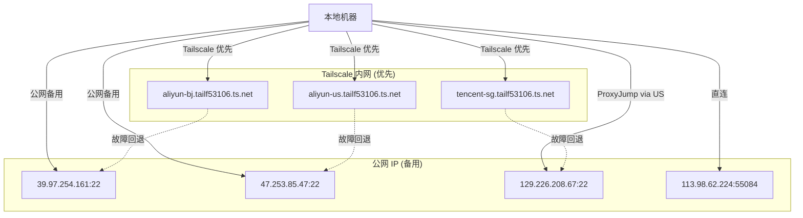
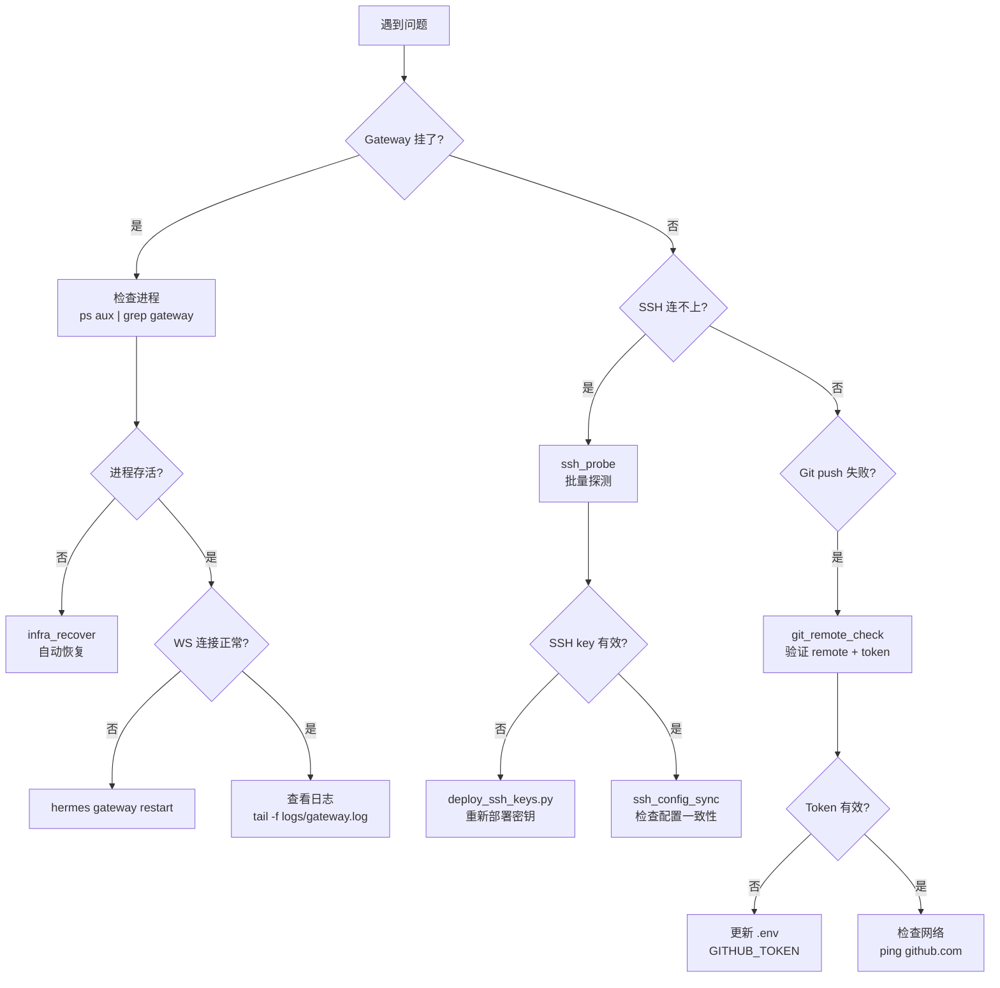

# infra-ops: 基础设施运维知识

## 核心概念

### deploy-servers.yaml 数据流

```
deploy-servers.yaml (配置 SSOT)
    ↓
SSH Environment (tools/environments/ssh.py)
    ↓ 读取 key_path, password_env
    ↓
SSH ControlMaster 连接池
    ↓
远程命令执行 / 文件同步
```

**谁读它**：
- `tools/environments/ssh.py`:SSHEnvironment 类 — 读取服务器配置建立 SSH 连接
- `tools/infra_tools.py`:infra 工具集 — 读取配置进行健康检查和探测
- `cron/infra_patrol.py`:巡检框架 — 读取配置进行批量 SSH 探测

**认证流程**：
1. 优先使用 `key_path` 指定的 SSH 私钥（默认 `~/.ssh/id_ed25519_deploy`）
2. 如果 key 认证失败，回退到 `password_env` 指定的环境变量（从 `.env` 读取）
3. SSH Environment 使用 ControlMaster 连接池，ControlPersist=300（5 分钟保持）

### 网络拓扑



**配置一致性**：
- `~/.ssh/config`:使用 Tailscale 域名（`aliyun-bj.tailf53106.ts.net`）
- `deploy-servers.yaml`:使用公网 IP（`39.97.254.161`）
- **两者必须保持同步**，使用 `ssh_config_sync` 工具检测差异

## Gateway 生命周期

### 启动命令

```bash
# Linux/macOS
hermes gateway run

# Windows
hermes gateway run
# 或
python -m gateway.run
```

### 停止命令

```bash
# 优雅停止（drain 活跃会话）
hermes gateway stop

# 强制停止（不等待会话完成）
hermes gateway stop --force
```

### 重启命令

```bash
# 优雅重启（drain + 启动新进程）
hermes gateway restart

# 替换重启（SIGTERM 旧进程 + 启动新进程）
hermes gateway run --replace
```

### 信号处理（POSIX）

| 信号 | 动作 | 退出码 |
|------|------|--------|
| SIGTERM / SIGINT | 优雅 drain + 停止 | 0（planned）或 1（unexpected） |
| SIGUSR1 | 服务重启（drain + 启动新进程） | 75（EX_TEMPFAIL，systemd 重启） |

### Windows 特殊处理

- **无信号处理器**：使用文件系统标记（`.gateway-planned-stop.json`）
- **planned-stop watcher 线程**：每 0.5s 轮询标记文件，检测到后触发优雅停止
- **启动方式**：Windows 计划任务（ONLOGON）或启动文件夹

### 退出码含义

| 退出码 | 含义 | systemd 行为 |
|--------|------|-------------|
| 0 | 干净停止（planned stop / takeover） | 不重启 |
| 1 | 意外信号（crash / OOM） | `Restart=on-failure` 重启 |
| 75 | 服务重启请求 | `Restart=always` 重启 |

## 故障排查决策树



## 恢复操作手册

### 场景 1:hermes-agent 目录被清空

**症状**:`hermes` 命令找不到，Gateway 进程消失

**恢复步骤**：
```bash
# 1. 使用 infra_recover 工具（推荐）
infra_recover

# 2. 或手动恢复
cd D:\hermes-data
git clone --depth 1 https://github.com/hermes-ai/hermes-agent.git hermes-agent
cd hermes-agent
uv sync --extra all --extra feishu
hermes gateway run
```

### 场景 2:Python venv 损坏

**症状**:`ModuleNotFoundError` 或 `hermes` 命令执行失败

**恢复步骤**：
```bash
# 1. 使用 infra_recover 工具
infra_recover

# 2. 或手动重建 venv
cd D:\hermes-data\hermes-agent
rm -rf .venv  # Windows: rmdir /s .venv
uv sync --extra all --extra feishu
```

### 场景 3:Feishu WebSocket 断连

**症状**:飞书机器人无响应，但 Gateway 进程存活

**恢复步骤**：
```bash
# 1. 检查 WS 状态
hermes gateway status

# 2. 重启 Gateway
hermes gateway restart

# 3. 等待 feishu connected 日志
tail -f logs/gateway.log | grep "feishu connected"
```

### 场景 4:SSH 密钥失效

**症状**:SSH 连接提示 `Permission denied (publickey,password)`

**恢复步骤**：
```bash
# 1. 探测 SSH 连通性
ssh_probe

# 2. 重新部署 SSH 密钥
python scripts/deploy_ssh_keys.py

# 3. 验证
ssh -i ~/.ssh/id_ed25519_deploy user@host
```

### 场景 5:Git push 失败

**症状**:`git push` 提示 `Authentication failed` 或 `Remote rejected`

**恢复步骤**：
```bash
# 1. 检查 remote 配置
git_remote_check

# 2. 验证 token
curl -H "Authorization: token $GITHUB_TOKEN" https://api.github.com/user

# 3. 更新 .env 中的 GITHUB_TOKEN
# 4. 重试 push
powershell -File scripts/push_to_github.ps1
```

## 自动巡检

使用 `infra-patrol` 工具进行全栈巡检：

```bash
# 快速巡检（Gateway + WS，每 15 分钟）
infra_patrol scope=quick

# 全量巡检（所有检查项，每 4 小时）
infra_patrol scope=full

# 指定类别
infra_patrol scope=category category=ssh
infra_patrol scope=category category=gateway
infra_patrol scope=category category=git
```

**巡检报告**：`{HERMES_HOME}/reports/patrol-{timestamp}.json`

**三级响应**：
- **Level 1（自动修复）**:venv 缺失、Gateway 进程消失、WS 断连、skills 版本漂移
- **Level 2（建议修复）**:SSH key 过期、配置不一致、磁盘空间低
- **Level 3（仅报告）**:Git 不可达、token 失效、未 commit 改动

## 相关工具

- `infra_health_check`:检查 hermes 完整性
- `infra_recover`:一键恢复
- `ssh_probe`:批量 SSH 探测
- `ssh_config_sync`:检查 SSH 配置一致性
- `git_remote_check`:验证 Git remote + token
- `gateway_status`:查询 Gateway 状态
- `infra_patrol`:全栈巡检

## 相关文件

- `config/deploy-servers.yaml`:服务器配置 SSOT
- `~/.ssh/config`:SSH 客户端配置
- `hermes-agent/tools/infra_tools.py`:infra 工具集实现
- `hermes-agent/cron/infra_patrol.py`:巡检调度器
- `hermes-agent/gateway/run.py`:Gateway 主循环
- `logs/gateway.log`:Gateway 日志
- `logs/agent.log`:Agent 日志
